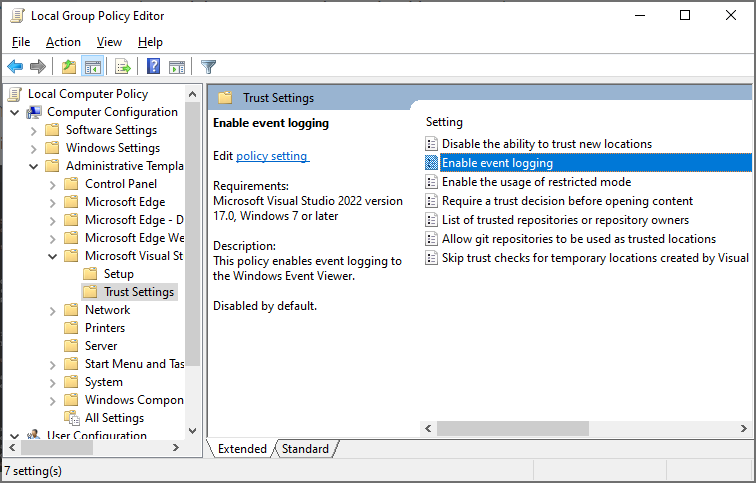

# Visual Studio Administrative Templates

This repository contains the administrative templates for the Visual Studio family of products.

These templates define what what Visual Studio functionality can be centrally managed by group policy.

## Testing locally

On Windows, you can test locally by leveraging the Windows Local Group Policy Editor:

### Step 1: Download the templates

- Clone the repository or download the latest release.
- Browse the files till you find the applicable .admx file.

### Step 2: Insert templates into the Windows policy definitions folder

- Open File Explorer and navigate to the **Policydefinitions** folder:
   > C:\Windows\PolicyDefinitions
- Copy the desired .admx file into this location
- Navigate to the **en-US** (or the applicable langue) folder
   
   > C:\Windows\PolicyDefinitions\en-US
- Navigate into the applicable languge folder next to .admx file selected in Step 1
- Copy the .adml file into the respective **Policydefinitions** folder

### Step 3: Test using the Local Group Policy Editor
- Open the Windows Local Group Policy Editor
- Navigate to the **Administrative Templates > Microsoft Visual Studio** node

Once on this node, you should see all the applicable policy settings for Visual Studio.

**Note:** Depending on your company's policy, you'll need to to force a group policy update via **gpupdate.exe**

## Contributing

This project welcomes contributions and suggestions.  Most contributions require you to agree to a
Contributor License Agreement (CLA) declaring that you have the right to, and actually do, grant us
the rights to use your contribution. For details, visit https://cla.opensource.microsoft.com.

When you submit a pull request, a CLA bot will automatically determine whether you need to provide
a CLA and decorate the PR appropriately (e.g., status check, comment). Simply follow the instructions
provided by the bot. You will only need to do this once across all repos using our CLA.

This project has adopted the [Microsoft Open Source Code of Conduct](https://opensource.microsoft.com/codeofconduct/).
For more information see the [Code of Conduct FAQ](https://opensource.microsoft.com/codeofconduct/faq/) or
contact [opencode@microsoft.com](mailto:opencode@microsoft.com) with any additional questions or comments.

## Trademarks

This project may contain trademarks or logos for projects, products, or services. Authorized use of Microsoft 
trademarks or logos is subject to and must follow 
[Microsoft's Trademark & Brand Guidelines](https://www.microsoft.com/en-us/legal/intellectualproperty/trademarks/usage/general).
Use of Microsoft trademarks or logos in modified versions of this project must not cause confusion or imply Microsoft sponsorship.
Any use of third-party trademarks or logos are subject to those third-party's policies.
